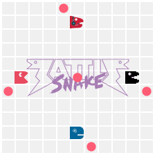
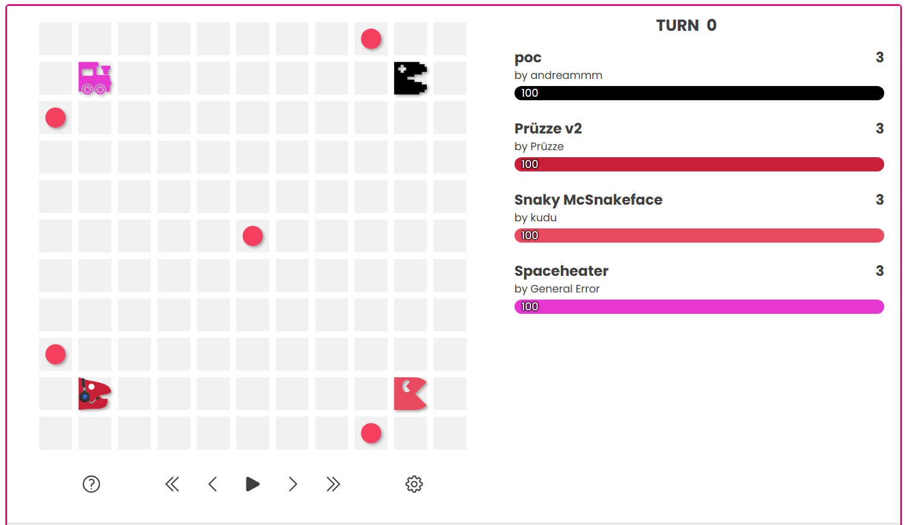
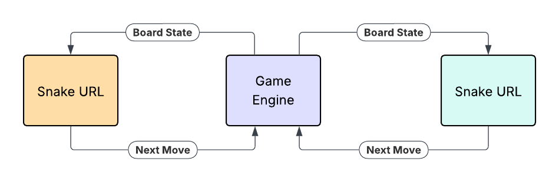

# Battlesnake 101

<!-- TOC -->

* [Battlesnake 101](#battlesnake-101)
    * [Concept](#concept)
    * [Infrastructure](#infrastructure)
    * [Gameplay](#gameplay)
        * [1) Battlesnake Details](#1-battlesnake-details)
        * [2) Game Started](#2-game-started)
        * [3) Move](#3-move)
        * [4) Game Over](#4-game-over)

<!-- TOC -->

## Concept

You play [Battlesnake](https://play.battlesnake.com/) by writing code that plays the game. The objective is to be the
last snake remaining. Each turn, you lose one health and you have to move. You have 500 milliseconds to decide which way
to move. There are a few ways to lose:

- Move outside the bounds of the board.
- Move into another snake. Head-to-head collisions will only kill the smaller of the two snakes.
- Run out of health

Avoiding all three hazards is easy at the start of the game. As the game progresses, snakes get longer. Good moves
require more strategy.

During the first session, you will register your snake with
the [Battlesnake Leaderboards](https://docs.battlesnake.com/guides/leaderboards). Each evening, your snake will face off
against other snakes in the public leaderboard and build a rating. We will track the ratings of program participants and
send out a regular email with Encova's internal leaderboard. If we do this right, Battlesnake will give you the freedom
to experiment with new technologies and explore new concepts while reinforcing your learning with friendly competition.

## Infrastructure

In each game of [Battlesnake](https://play.battlesnake.com/), a game engine will communicate with participating snake
servers through an Application Programming Interface (API). An API allows two programs to share information via an
agreed-upon standard. In this case, the API is
an [HTTP REST API](https://www.redhat.com/en/topics/api/what-is-a-rest-api). Let's break that down:

- HTTP: HTTP is a common protocol for communication over the internet. HTTP requests have "methods" that communicate the
  intent of the requestor. We'll only be working with two of them:
    - GET: A good example of a GET request: "What is your name?"
        - It doesn't introduce any new information (There's no `body` or `payload`).
        - The response doesn't change the state of the answerer or server.
    - POST: A good example of a POST request: "We're going to dinner at that Thai place you love."
        - The request carries new information (It has a `body` or `payload`).
        - The response might just be an acknowledgement of receipt, but I will also be expected to change my state (e.g.
          join you for dinner).
- REST: Calling an API "RESTful" is like calling an apple organic. It is a terse way to communicate the underlying
  standards that were used to create the object. In the case of an organic apple, "organic" tells you that the farmer
  avoided synthetic pesticides. We don't need to get into the details of a RESTful API here because the implementation
  details are nicely abstracted by Python's [FastAPI](https://fastapi.tiangolo.com/) library.

For the game engine to communicate with your snake's REST API, your snake needs to be running and the game engine needs to be able
to reach it. The game server can't access your snake while it's running on your local computer. We will "host" your
snake server on [Railway](https://railway.com/) and set it up to be publicly accessible at a URL that we will register
with Battlesnake.com. Railway will make sure your snake is running and make it accessible to the game engine.

Your snake server could be written in any programming language. We're going to use Python for this program.

## Gameplay

### 1) Battlesnake Details

At the beginning of each game, the game engine sends a `GET /` request to participating snake servers
requesting [battlesnake details](https://docs.battlesnake.com/api/webhooks#battlesnake-details). This is used to
represent the initial state of the board

### 2) Game Started

Next, the game engine will send a `POST /start` request
with [game details](https://docs.battlesnake.com/api/webhooks#game-started). Your snake isn't expected to respond to
this request. In the future, you may want to use this request to record game-specific information or provision
game-specific resources. We'll ignore it for now.

### 3) Move

This stage makes up the bulk of the game. Each turn, the game engine will send a `POST /move` request with
the [current board state](https://docs.battlesnake.com/api/webhooks#move) to participating snake servers. Each snake
will have 500 milliseconds to respond with
its [next move](https://docs.battlesnake.com/api/webhooks#response-properties-2).

### 4) Game Over

Finally, the game engine will send a `POST /end` request
with [game details](https://docs.battlesnake.com/api/webhooks#game-over). Like the [game started](#2-game-started)
request, your snake isn't expected to respond to this request. It is often used to record game information or tear down
game-specific resources. We'll ignore it for now.
