# Development Workflow

<!-- TOC -->

* [Development Workflow](#development-workflow)
    * [Set up your Development Environment](#set-up-your-development-environment)
    * [Create and Checkout a Feature Branch](#create-and-checkout-a-feature-branch)
    * [Make a change](#make-a-change)
    * [Stage your changes](#stage-your-changes)
    * [Commit your changes](#commit-your-changes)
    * [Push your changes](#push-your-changes)
    * [Keep Up To Date With Development](#keep-up-to-date-with-development)
* [Merge Request](#merge-request)
    * [Creation](#creation)
    * [Review](#review)
    * [Merge](#merge)
    * [Cleanup](#cleanup)
        * [Delete your local feature branch](#delete-your-local-feature-branch)

<!-- TOC -->

## Overview

First, watch this [YouTube primer on Git](https://learngitbranching.js.org/. It does an excellent job of covering high
level concepts that we'll be referring to here.

Here's a link to a [browser-based git training game](https://learngitbranching.js.org/) that can be used to experiment
with git without worrying about a file system. It has drills and descriptive tutorials that will make you comfortable
with the tool in no time!

This is ~~~~~~~~

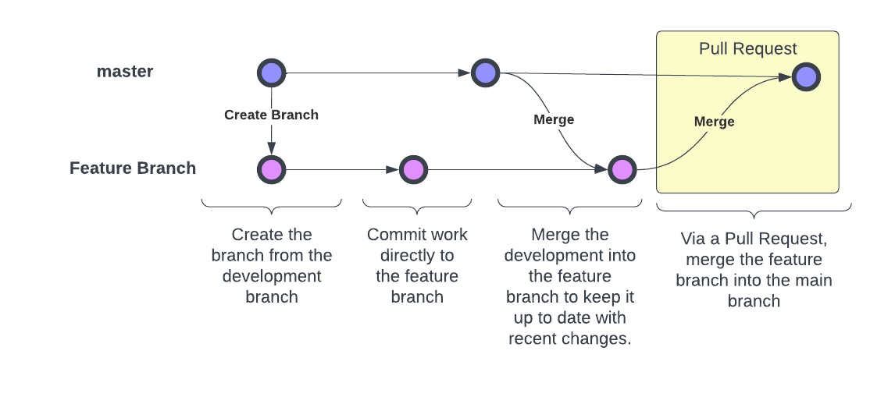

## Set up your Development Environment

If you haven't done so already, complete the steps defined
in [Setting up a Development Environment](./setting_up_dev_env.md). **If you experience any issues, the first
troubleshooting step will be to verify that you followed each of the steps in that document.**

## Create and Checkout a Feature Branch

**VS Code**

1. Your current branch name is displayed in the bottom left-hand side of the window. Click on that to launch the
   branch-picker

   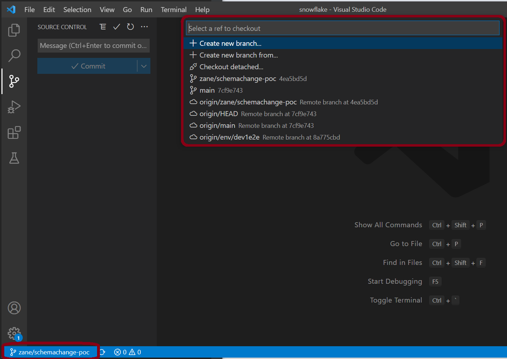

2. Type in `master`. If `master` is an option, it means you have already checked that branch out. Select that.
   Otherwise,
   select `origin/master`. The `master` branch as it is in GitLab is referred to as `origin/master`

   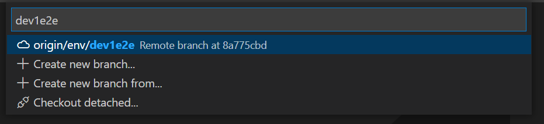

3. Open the source control tray. If the button offers to "Sync Changes", click it to get the latest from GitLab

   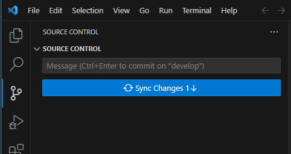

   If the button is disabled, you have the latest and can proceed to the next step

   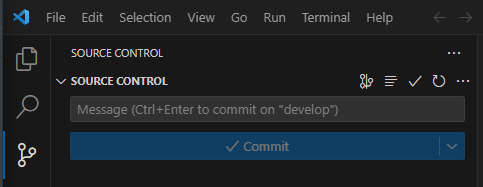

4. Click on your current branch name in the bottom left-hand side of the window to launch the branch-picker.
   Select `Create new branch...

   

5. Supply your name and press enter

   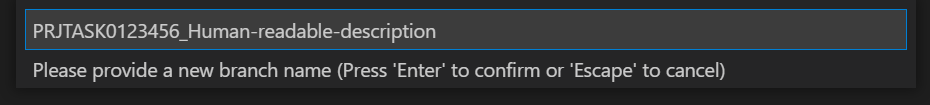

**Terminal**

1. Check out the `master` branch:
   ```bash
   git checkout master
   ```
2. Ensure you're working on the latest version of the `master` branch:
   ```bash
   git pull
   ```
3. Run `git status`. The output should read:
   > Your branch is up-to-date with 'origin/master'.
   > nothing to commit, working tree clean
4. Create a "feature" branch from the `master` branch.
   ```bash
   git checkout -b Human-readable-description
   ```

## Make a change

Have fun!

## Stage your changes

Right now, your change is "unstaged". There are two ways to stage your unstaged changes. You can stage new changes as
often as you want.

**VS Code**:

With the Source Control tray open, select the `+` to the right of the files under `Changes`

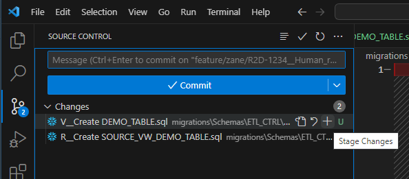

The changes are now staged, ready to commit

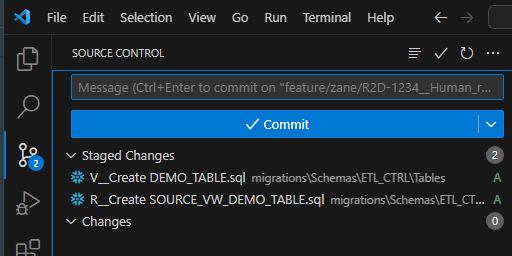

**Terminal**:

When you run `git status`, your output will look like this:

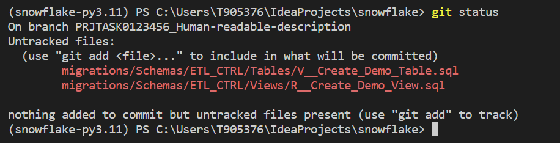

The red files are untracked or unstaged. To add them, run `git add .` **This will add all untracked changes.** You can
also add specific files by referring to them in the `add` command. Run `git status` again. The files should now be
green.

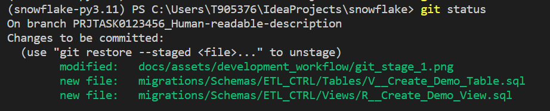

They are ready to commit!

## Commit your changes

When you commit your changes, they become part of the history of the branch and repository. That's why a commit message
is required by git. You can commit as many times as you like. Experienced git practitioners commit often, as it provides
a checkpoint to return to and the commit messages tell a story. Start your commit message with the story number. For
example:

- `implementing a`
- `switching from a to b to avoid timeout error`
- `refactoring b to c`

Future developers can follow this narrative to understand decisions that lack any other form of documentation.

**VS Code**:

In the message box above the `Commit` button, type a short message describing your changes

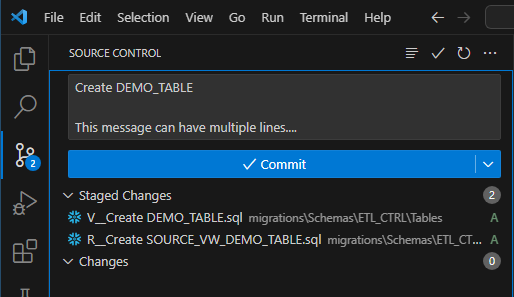

Press `Commit`. Your changes are ready to push!

**Terminal**:

Use the following command, replacing your commit message with the sample:

   ```bash
   git commit -m "<your commit message here>"
   ```

## Push your changes

Your changes aren't on GitLab yet. You need to push your commit from your local environment to GitLab, what git
calls the `origin`.

**VS Code**:

If this is your first push on your branch, you'll see this `Publish branch` button

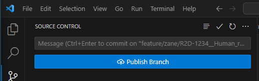

If the branch has already been published to the `origin`, the button will read `Sync Changes` instead

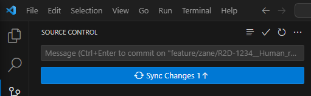

**Terminal**:

Execute the following:

   ```bash
   git push --set-upstream origin Human-readable-description
   ```

## Keep Up To Date With Development

When you created your branch, it was a copy of `master`. Since that time, `master` may have changed.
These changes could conflict with your changes and cause your work to be unable to merge. This is called a **merge
conflict**. Merge conflicts are easier to handle when they are small and recent. To keep your conflicts small and
recent, keep your branch up to date with the changes in `master` by **merging** `master` into your
feature branch. Make sure all of your changes are committed to your feature branch, and you have your feature
branch checked out.

**VS Code**:

Press `Ctrl` + `Shift` + `P` to open up the command pallet.

Search for `merge` and select `Git: Merge Branch...`

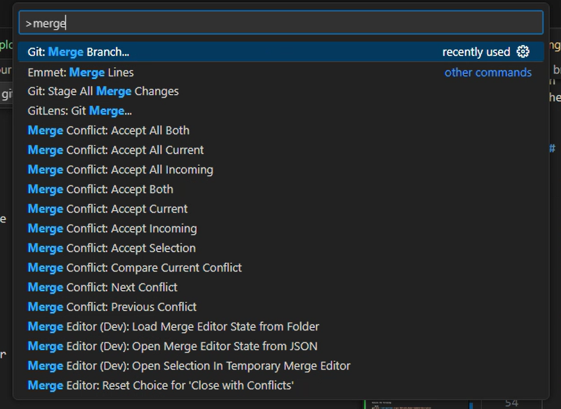

Find the development branch and select it

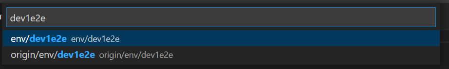

**Terminal**:

Execute the following:

   ```bash
   git merge master
   ```

# Merge Request

## Creation

1. Navigate to GitLab and select `Code` -> `Branches`.

   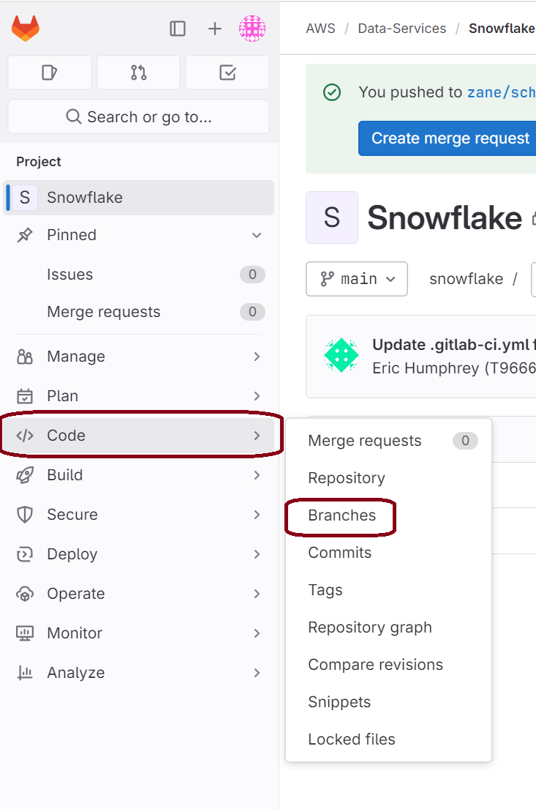

2. Locate your feature branch and select the `New` button to the right of the branch to create a merge request

   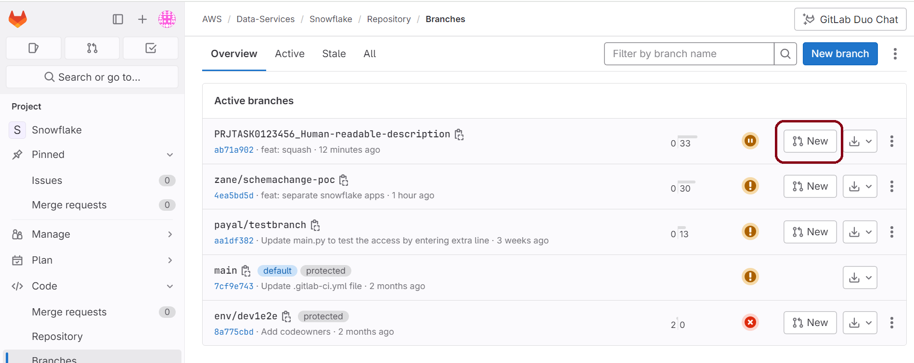

3. On the Create a Merge Request form

   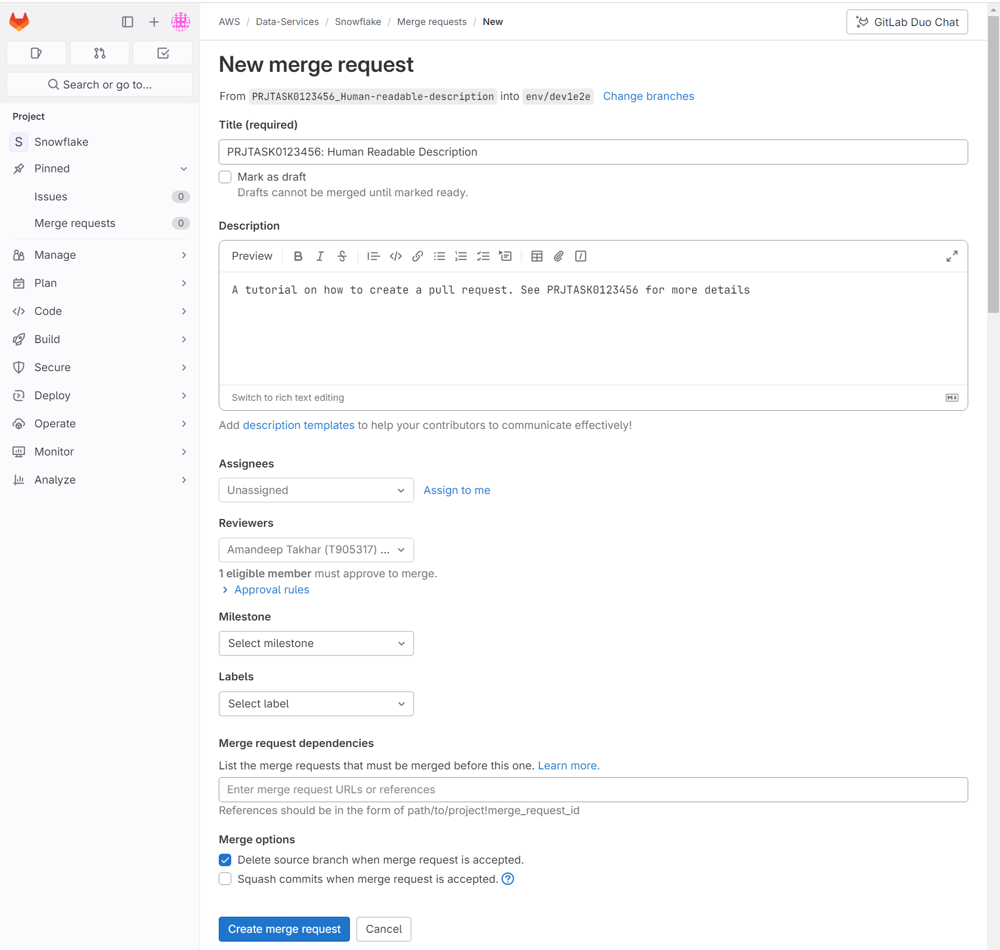

    - **From + Into Branches**: Your feature branch will be the `From` branch. You may need to select `Change Branches`
      to target the `master` branch.
    - **Title**: `Human Readable Description`
    - **Description**: This is your opportunity to tell a more cohesive story than what you might have told with
      individual commit messages. Include a link to the ticket and any available unit testing documentation.
    - **Reviewer**: Normally, we assign at least two reviewers. For this project, there's no need to assign a reviewer
    - **Delete source branch when request is accepted**: **Check the box to delete your branch when the merge request
      is merged.** If you don't do this, the repo will eventually have tons of old or "stale" branches.

4. Click `Create merge request`. For this project, you won't require a review to merge in your changes. When you do
   require a review, consider copying the merge request URL and sharing it with the reviewer to expedite the review
   process. Depending on their email notification settings, they may not receive a notification that their review has
   been requested.

5. Monitor Merge Request Pipeline

   TODO: Document developer expectations post merge-request creation.

## Review

Have fun!

## Merge

GitLab will prevent you from merging your merge request until it meets the approval requirements. For this project,
there are no approval requirements. **Ensure the box is checked to delete the feature branch after the merge.88

## Cleanup

After the merge is completed, check out and pull the latest from the `master` branch on your local machine by following
steps 1-3 of [Create and Checkout a Feature Branch](#create-and-checkout-a-feature-branch). Your changes should now be
reflected in your local `master` branch. Delete your local feature branch

### Delete your local feature branch

**VS Code**:

Press `Ctrl` + `Shift` + `P` to open up the command pallet.

Search for `delete` and select `Git: Delete Branch...

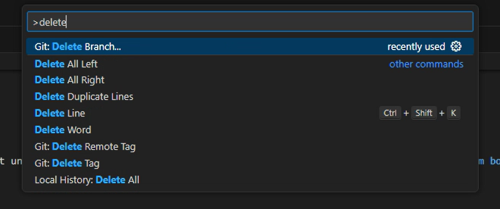

Select your feature branch: `Human-readable-description

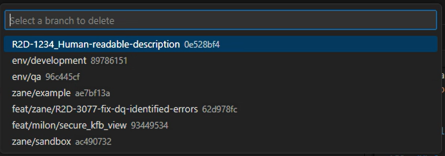

**Terminal**:

Use the following command:

   ```bash
   git branch -d Human-readable-description
   ```
