# Participant Deployment

Let's deploy your first Battlesnake

<!-- TOC -->
* [Participant Deployment](#participant-deployment)
  * [Create a Railway account](#create-a-railway-account)
  * [Create a Battlesnake.com account](#create-a-battlesnakecom-account)
  * [Admin Deployment](#admin-deployment)
  * [Configure Networking](#configure-networking)
  * [Register Snake with Battlesnake.com](#register-snake-with-battlesnakecom)
  * [Play Your First Game of Battlesnake](#play-your-first-game-of-battlesnake)
  * [Register for the Standard Leaderboard](#register-for-the-standard-leaderboard)
<!-- TOC -->

## Create a Railway account

Create a Railway account.

1. Navigate to [Railway login](https://railway.com/login).
2. You can use your Google account, GitHub account, or an email address.
3. Agree to the terms of service.
4. Agree to their fair use policy.
5. **STOP**: Wait until the admin deployment step concludes before you take any more action.

Check In Instructions: Put your Railway email in the meeting chat

## Create a Battlesnake.com account

1. Navigate to [battlesnake.com/register](https://play.battlesnake.com/register).
2. You can use your email address or GitHub account.
3. Complete the email verification process.
4. **STOP**: Wait until the admin deployment step concludes before you take any more action.

## Admin Deployment

Check In Instructions: Put your T-number and your desired snake's name in the meeting chat

An admin will need to complete the [admin deployment](./admin_deployment.md) steps. They will need the following
information from you:

- Your T-number (e.g. `T905376`)
- Your desired snake's name (e.g. `Venomous Webhook`)
- The email address that you used to register with Railway (e.g. `zane.clark@pwc.com`)

After the admin deployment steps have been completed, you will receive an email invitation to join a Railway project
with your name on it. Accept that invitation and ensure you can view it in the Railway dashboard.

## Configure Networking

The [admin deployment](./admin_deployment.md) steps deployed your repo, but the Battlesnake engine can't reach it. We
need to expose the service to outside traffic.

1. Navigate to the Railway project and select the service

   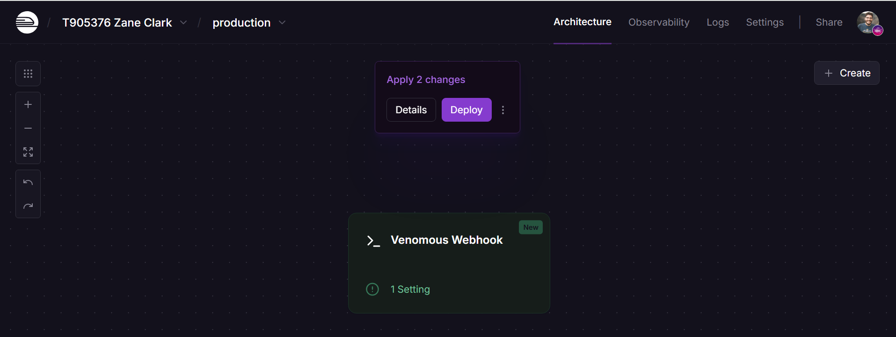
2. Navigate to `Settings`. Under `Networking` > `Public Networking`, select `Generate Domain`. It will take a few
   seconds for the domain to appear.

   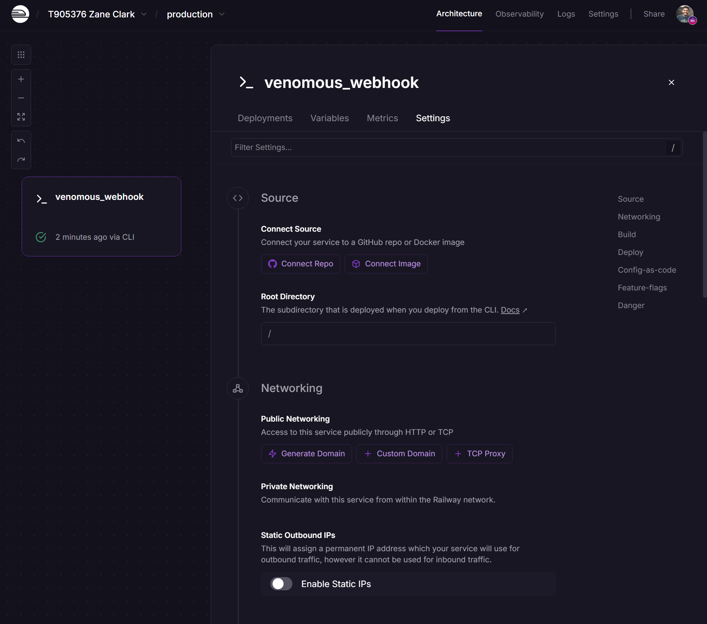
3. When the domain is visible, copy it. We will need it to register our snake with Battlesnake.com

   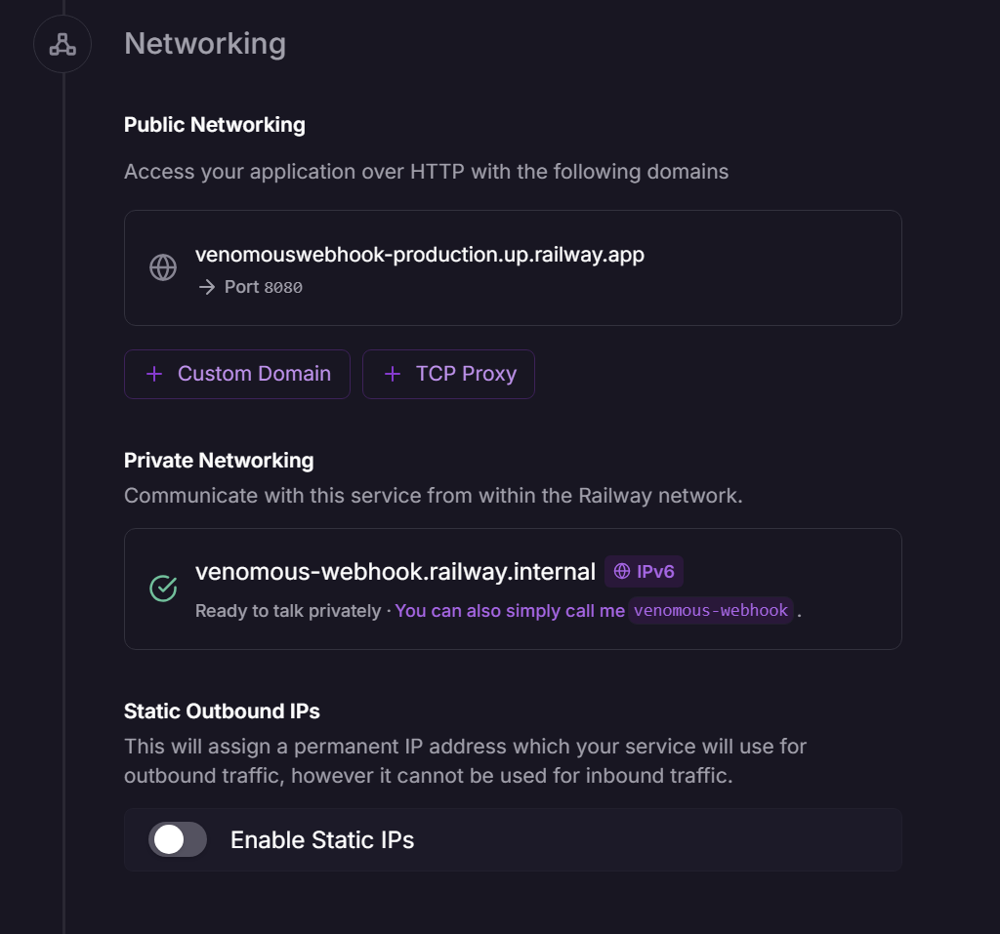

Check In Instructions: Put your domain in the meeting chat

## Register Snake with Battlesnake.com

Now we have a publicly-accessible domain that houses a REST API that's ready to play Battlesnake! Let's register the
snake with Battlesnake.com

1. [Login to Battlesnakes](https://play.battlesnake.com/login)
2. Select `My Battlesnakes` from the left menu.

   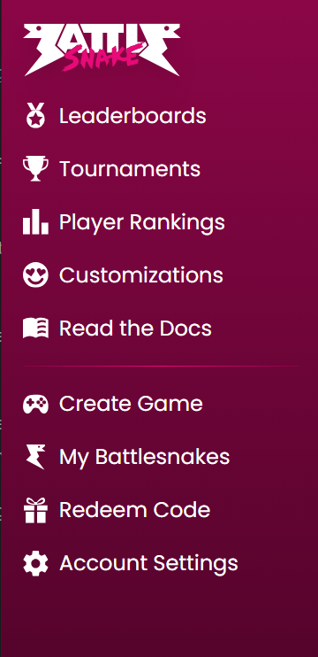
3. Create your snake:
    - **Name**: Your snake's name. It should match the GitLab repo and the Railway Service.
    - **Server URL**: The Railway domain we created in the last step. Be sure to prefix it with `https://`
    - **Engine Region**: US-WEST (Oregon)
    - **Programming Language**: Python
    - **Platform**: Railway
    - **Who can create custom games?**: If you allow anyone to create a custom game with your snake, you can play custom
      games against your colleagues.

   Select `Save Battlesnake` to save your changes.

   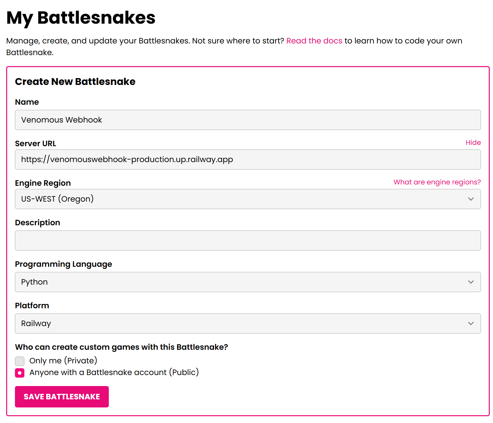

4. You should see your newly registered snake here

   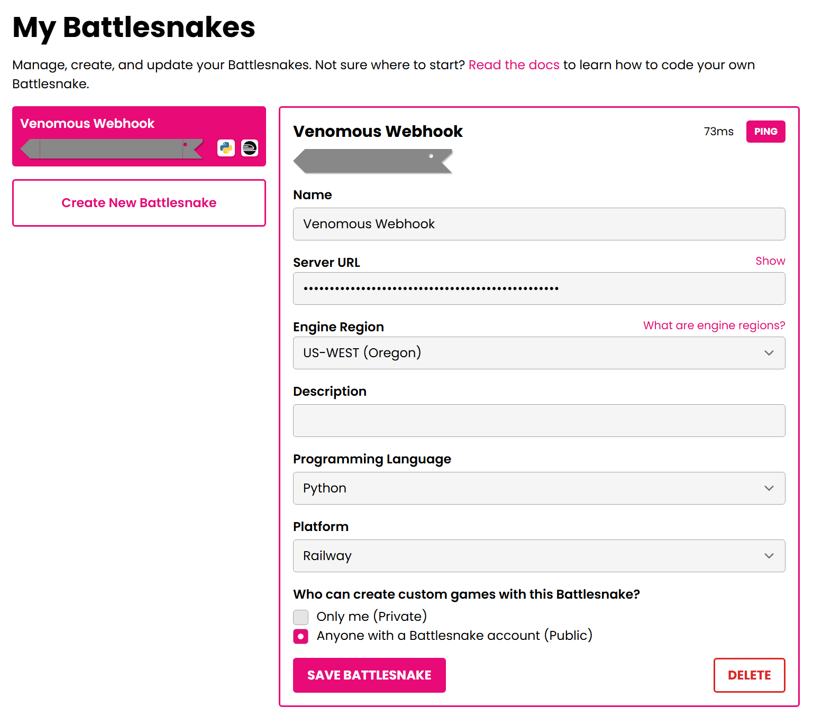

Check In Instructions: Put your registered snake's name in the meeting chat

## Play Your First Game of Battlesnake

1. Navigate to `Create Game`

   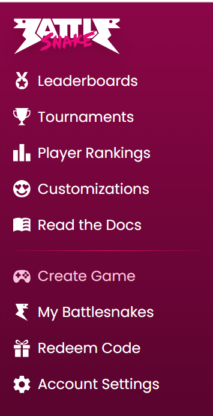

2. Add your snake to the map a few times and start a game.

   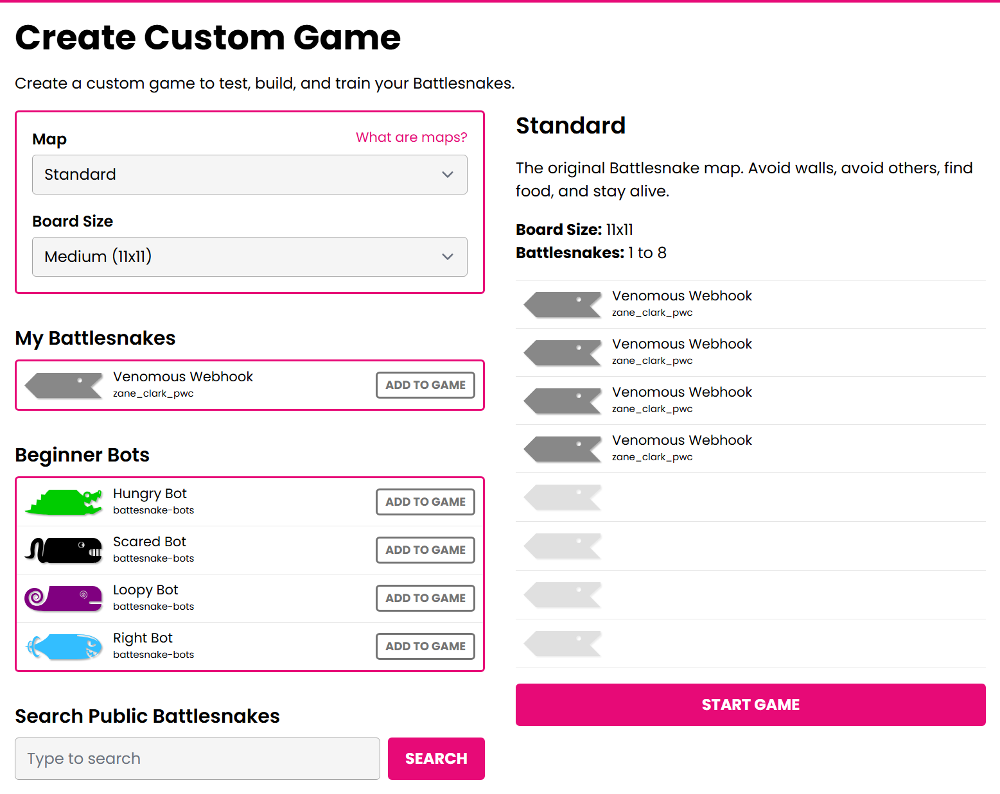

3. The game should be short given that we haven't taught your snake to survive. It is important that your snake turns.
   If the game engine doesn't receive a response to the turn POST request, it will reuse the last response. As a result,
   unresponsive snakes will go in a straight line until they run into something. If your snake turns at this stage, it's
   a good sign.

   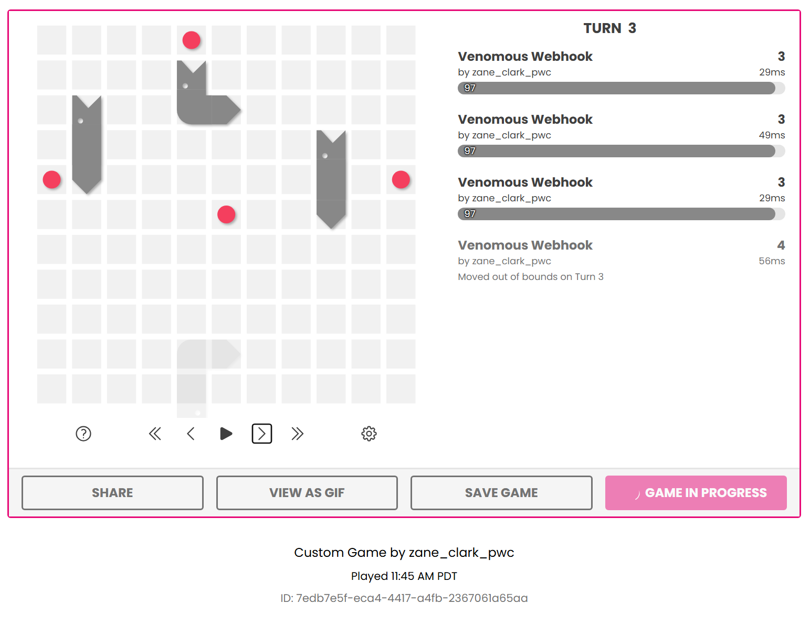

4. We can see our server respond to these requests by navigating back to the Railway project and selecting the service.
   On the `Service Menu` / `Deployments` tab, select `View logs` to see the logs from the latest deployment.

   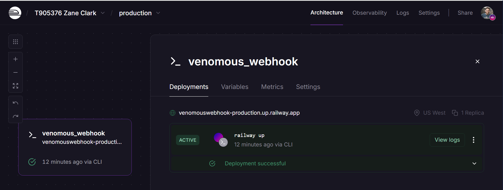

5. You can see the move responses from the HTTP Logs.

   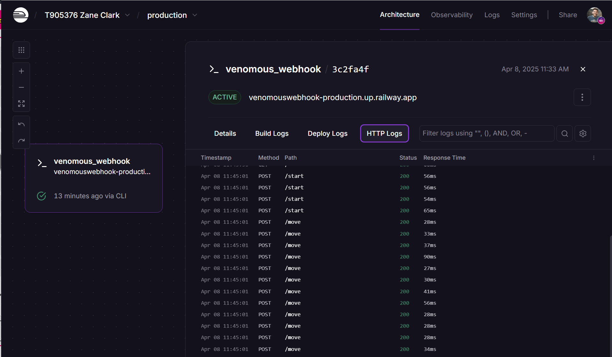

Check In Instructions: Play a custom game against a colleague's snake

## Register for the Standard Leaderboard

1. Navigate to the Battlesnake [Standard Leaderboard](https://play.battlesnake.com/leaderboard/standard).
2. Under `Join Leaderboard`, use the combo box to select your snake and select `Enter Battlesnake`.

   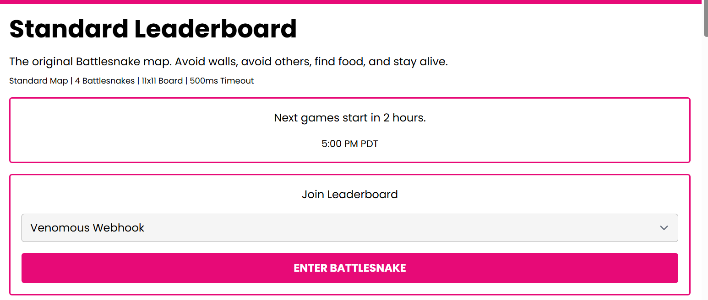
3. Let the games begin!

   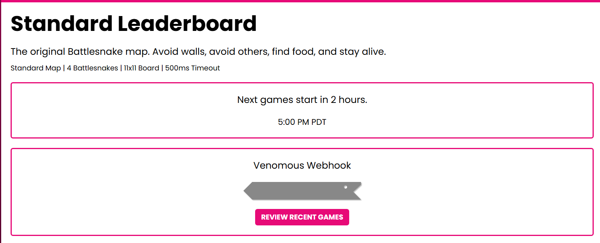
