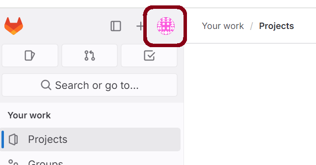
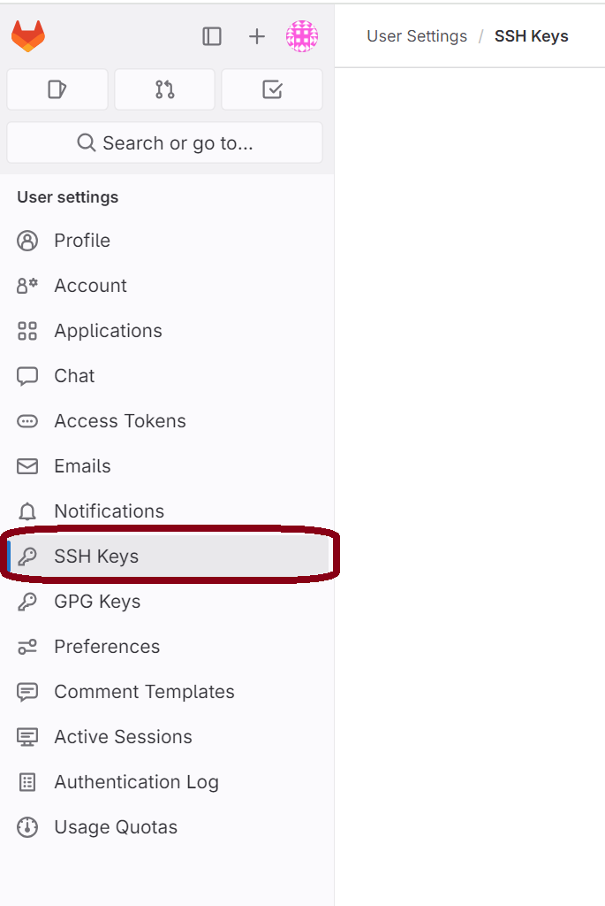
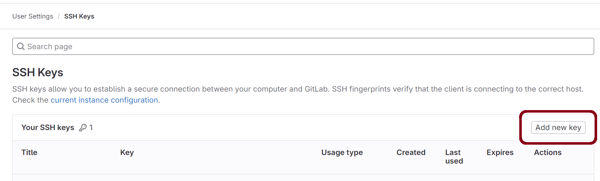
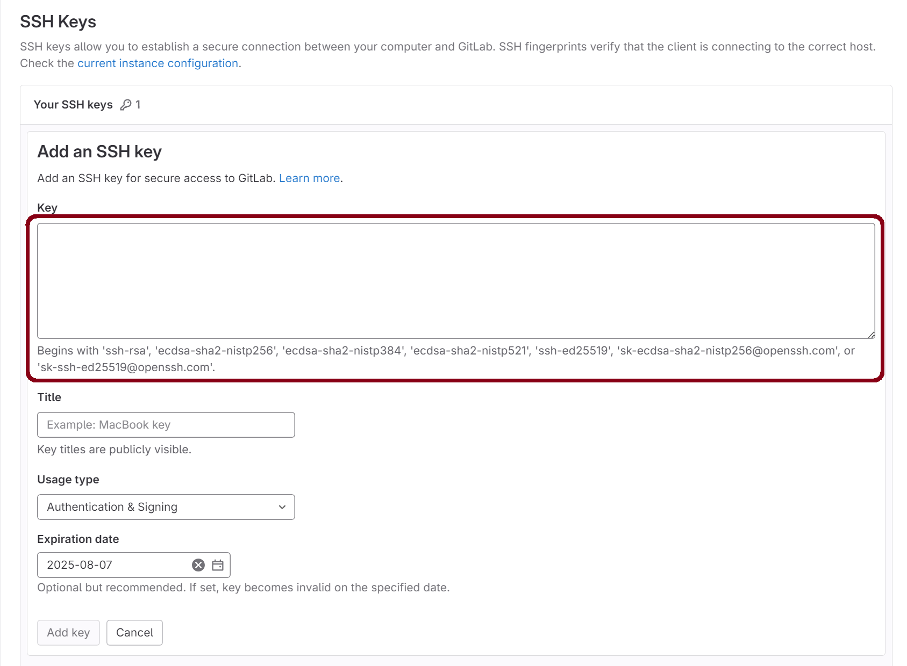
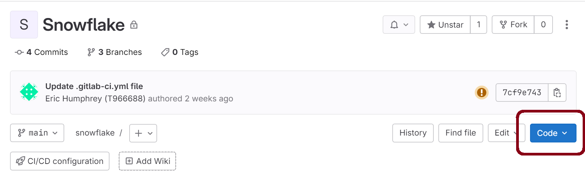
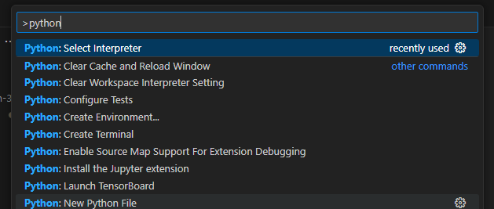

# Setting up a Development Environment

<!-- TOC -->

* [Setting up a Development Environment](#setting-up-a-development-environment)
    * [Required installations](#required-installations)
        * [Git](#git)
        * [Visual Studio Code](#visual-studio-code)
        * [Python 3.11](#python-311)
        * [PDM](#pdm)
    * [Configure git](#configure-git)
        * [Set Git Username and Email](#set-git-username-and-email)
        * [Create an SSH Key Pair](#create-an-ssh-key-pair)
        * [Add Public SSH Key to GitLab Profile](#add-public-ssh-key-to-gitlab-profile)
    * [Clone the Repository](#clone-the-repository)
    * [Install Python Dependencies](#install-python-dependencies)

<!-- TOC -->

## Required installations

### Git

Using PowerShell (not the Command Prompt), execute the following command:

```bash
git --version
```

If git is installed, the git version will print to the console. Continue to the next section.

If PowerShell doesn't recognize `git` as a command, install [Git for Windows](https://git-scm.com/download/win). Restart
your computer after you have completed all the installation steps to refresh your environment variables.

Check In Instructions: Put your git version in the meeting chat

### Visual Studio Code

[Visual Studio Code](https://code.visualstudio.com/download) is the IDE that we will use throughout the program. It
will allow you to write and test your code in an application with integrated tools. Configure VS code accordingly:

1. Enable [Autosave](https://code.visualstudio.com/docs/editor/codebasics#_save-auto-save).
2. Install the [Python Extension](https://marketplace.visualstudio.com/items?itemName=ms-python.python)

### Python 3.11

Using PowerShell (not the Command Prompt), execute the following command:

```bash
python --version 
```

If Python is installed, the version will print to the console. Continue to the next section.

If PowerShell doesn't recognize `python` as a command,
install [Python 3.11](https://www.python.org/downloads/release/python-3119/).

- **Don't install anything newer than 3.11.**
- **During the installation, ensure that you add Python to PATH.** There's an option to do so in the first step
  of the process.

  

Restart your computer after you have completed all the installation steps to refresh your environment variables.

Check In Instructions: Put your python version in the meeting chat

### PDM

PDM is a modern Python package and dependency manager that will take care of dependency resolution and packaging. Using
PowerShell (not the Command Prompt), execute the following command:

```bash
pdm --version 
```

If PDM is installed, the version will print to the console. Continue to the next section.

If PowerShell doesn't recognize `pdm` as a command,
install [PDM](https://pdm-project.org/en/latest/#recommended-installation-method) using the "Windows" instructions.

Check In Instructions: Put your pdm version in the meeting chat

## Configure git

### Set Git Username and Email

Git will require a name and an email to be associated with each commit. Run the following command in a Powershell
terminal determine if you have already configured your name:

```bash
git config user.name
```

If your name isn't returned, run the following command to set it, replacing your name where appropriate:

```bash
git config --global user.name "your name here, punctuation is fine"
```

Let's do the same for your email:

```bash
git config user.email
```

If your email isn't returned, run the following command to set it. Use your _actual_ email here (
e.g. `zane.clark@encova.com`).

```bash
git config --global user.email "zane.clark@encova.com"
```

Configure Git to use the Windows certificate store. This tells Git to use the Secure Channel (schannel) library provided
by Windows for SSL/TLS connections, which in turn uses the Windows certificate store.

```bash
git config --global http.sslBackend schannel
````

#### Warning: Remote Host Identification Has Changed!

If the git server is ever migrated to a new server on the backend, you may see this warning:

```
Warning: Remote Host Identification Has Changed!
```

This will command remove the identity of the git server and allow you to "trust" the new identity:

```bash
ssh-keygen -R git.mmi.mig.corp
```

#### Account Deactivation

Your account will be deactivated if you don't use your GitLab account for a significant period of time. Deactivating
unused accounts helps Encova reduce licensing costs, as they only pay for active seats. **Your account has not been
deleted.** It simply needs to be reactivated. Logining into https://git.mmi.mig.corp/ will automatically reactivate your
account.

### Create an SSH Key Pair

GitHub's [official documentation](https://docs.gitlab.com/ee/user/ssh.html) on configuring SSH Key Authentication is
very thorough. The following configuration is the most basic configuration:

1. Generate a key pair.
   ```bash
   ssh-keygen -t ed25519 -C "john.doe@encova.com"
   ```
2. Press Enter to accept the default path.
   ```
   Generating public/private ed25519 key pair.
   Enter file in which to save the key (/home/user/.ssh/id_ed25519):
   ```
3. Specify a passphrase. Record this value in a secure location for future use.
   ```
   Enter passphrase (empty for no passphrase):
   Enter same passphrase again:
   ```
4. Create a file at `~/.ssh/config` with the following contents:
   ```
   Host git.mmi.mig.corp
     PreferredAuthentications publickey
     IdentityFile ~/.ssh/id_ed25519
   ```

### Add Public SSH Key to GitLab Profile

1. Sign in to GitLab.
2. On the left sidebar, select your avatar.

   
3. Select Edit profile.

   
4. On the left sidebar, select SSH Keys.

   
5. Select Add new key.

   
6. When you created the key above, a public key was also created. Copy that key to your clipboard.
   ```bash
   Get-Content ~/.ssh/id_ed25519.pub | clip
   ```

7. In the Key box, paste the contents of your public key. Naming the key is useful if you will have multiple devices
   with a key (e.g. a laptop and a desktop). Remove the expiration date.

   
8. Select "Add Key" to save the key to your profile.
9. Execute the following to validate your SSH key configuration:
   ```bash
   ssh -T git@git.mmi.mig.corp
   ```

   If that command fails, add a `vvv` flag to increase the verbosity of the output. This can help you understand how to
   fix the error:
   ```bash
   ssh -Tvvv git@git.mmi.mig.corp
   ```

## Clone the Repository

1. (Optional) If you don't already have one, create a local directory for git projects and navigate to that directory.
   ```bash
   mkdir ~/Encova_Projects && cd ~/Encova_Projects
   ```
2. Navigate to the repo and select the "Clone" button.

   

3. Next to "Clone with SSH", select "Copy URL"

   
4. In your GitBash terminal, type `git clone` and paste the URL from your clipboard. Execute the command.
   ```shell
   git clone git@git.mmi.mig.corp:aws/data-services/snowflake.git
   ```

## Install Python Dependencies

Virtual environments are considered a best practice for Python development. If you are using Python for multiple
projects on your computer, you can end up with conflicting dependencies. For example, Project A wants 1.1.1 and Project
B wants 1.2.3. You can support both requirements with
project-specific [virtual environments](https://docs.python.org/3/library/venv.html). Each virtual environment has an
independent set of Python packages. While working on Project A, you have access to the required 1.1.1 dependency. While
working on Project B, you have access to the required 1.2.3 dependency.

1. Ensure that you're using the latest version of pip:
   ```bash
   python.exe -m pip install --upgrade pip
   ```
2. Use PDM to create a virtual environment in the project directory and install the dependencies. This will create a
   `.venv` folder in the directory that will house your Python
   dependencies.:

   ```bash
   pdm install
   ```

3. To manually activate the virtual environment:
    - Powershell: `.venv\Scripts\Activate.ps1`
    - cmd: `.venv\Scripts\activate.bat`
4. To automatically activate your virtual environment, register your virtual environment with your IDE:
    * VS Code:
        1. Open the Command Palette (Ctrl+Shift+P)
        2. Find and select "Python: Select Interpreter"

           
        3. Select the interpreter at the path `.\.venv\Scripts\python.exe`
        4. Now, every terminal you open with this project will automatically activate the virtual environment!
